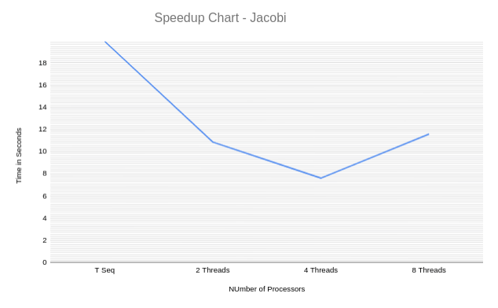
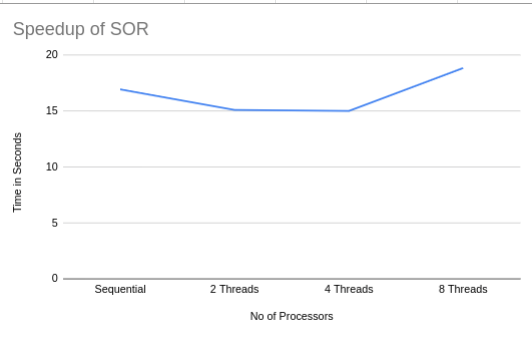
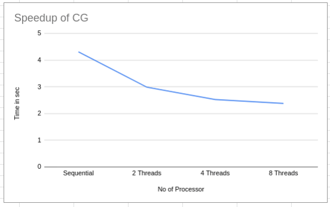
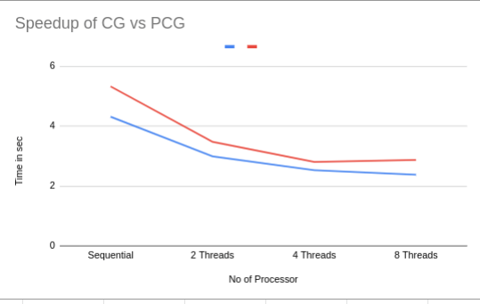
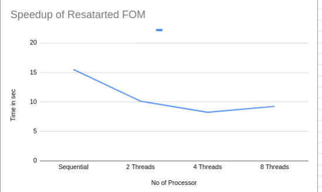
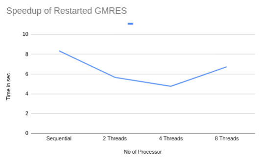

# Iterative Solvers for Finite Element Problems
---

This code was generated as a part of [1D FEM Code](https://github.com/thivinanandh/1D_FEM_Solver_Parallel) to solve the sparse matrices that arises out of 1D finite element discretisation. 

## Implemented Solvers
---

* JACOBI
* SOR
* CG
* FOM
* GMRES

## Implementation Scheme
---

All the solvers were speifically written for matrices stored in compressed sparse row format (CSR). They need **intel mkl** routines for internal blas operations. 

## Performance Analysis 
---

We have analyzed the performance of these sparse solvers using various metrics such as peak FLOPS, Arithmetic INtensity, speedup (openmp) using intel's libraries. 

JACOBI SOLVER
==========================

The Jacobi Solver is slightly inefficient in terms of convergence rates
compared with the other Iterative Solvers. However It is the best
Algorithm in terms of its parallelisation efficiency.

| **Specification**    | **Value**                    |
|----------------------|------------------------------|
| Sequental Time       | 19.9261 Seconds              |
| FLOPS                | 11.81 GFLOPS                 |
| ARITHMETIC INTENSITY | 0.14 FLOP/BYTE               |
| SPEEDUP              | 1.720704                     |
| EFFICIENCY           | 0.215805 ( For 8 processor ) |

SOR SOLVER 
=======================

The SOR ( Successive Over Relaxation ) is the weighted Gauss Seidal
Solver. Though this solver is highly efficient than the Jacobi solver in
terms of convergence, On HPC terms this algorithm is highly non
parallelisable.

The test Setup for this Solver will be a 1D - Finite Element Matrix of
fourth order shape functions with N DOF as 400001 and the max iteration
is set as 500.

| **Specification**    | **Value**                   |
|----------------------|-----------------------------|
| Sequental Time       | 16.9472                     |
| FLOPS                | 3.81 GFLOPS                 |
| ARITHMETIC INTENSITY | 0.11 FLOP/BYTE              |
| SPEEDUP              | 1.12158                     |
| EFFICIENCY           | 0.28039 ( For 4 processor ) |

CG SOLVER
=====================

CG Solver is used to solve symmetric matrices and this method can
provide us an assurance on the number of Steps for convergence compared
with other methods.

The test Setup for this Solver will be a 1D - Finite Element Matrix of
fourth order shape functions with N DOF as 400001 and the max iteration
is set as 500.

| **Specification**    | **Value**                 |
|----------------------|---------------------------|
| Sequental Time       | 4.3142                    |
| FLOPS                | 2.61 GFLOPS               |
| ARITHMETIC INTENSITY | 0.12 FLOP/BYTE            |
| SPEEDUP              | 1.1812                    |
| EFFICIENCY           | 0.226 ( For 8 processor ) |

CG SOLVER with Jacobi Preconditioner 
===================================================

CG Solver is used to solve symmetric matrices and this method can
provide us an assurance on the number of Steps for convergence compared
with other methods.

The test Setup for this Solver will be a 1D - Finite Element Matrix of
fourth order shape functions with N DOF as 400001 and the max iteration
is set as 500.

| **Specification**    | **Value**                 |
|----------------------|---------------------------|
| Sequental Time       | 5.32431                   |
| FLOPS                | 1.19 GFLOPS               |
| ARITHMETIC INTENSITY | 0.11 FLOP/BYTE            |
| SPEEDUP              | 1.8965540                 |
| EFFICIENCY           | 0.237 ( For 8 processor ) |

Restarted FOM 
==========================

Restarted FOM uses Arnoldi Iterations to compute Q and H and Solves
exactly H and eo to get minimise the residual. In out Simulation we will
use a restart factor of 10. The test Setup for this Solver will be a 1D
- Finite Element Matrix of fourth order shape functions with N DOF as
400001 and the max iteration is set as 500.

| **Specification**    | **Value**                  |
|----------------------|----------------------------|
| Sequental Time       | 15.498                     |
| FLOPS                | 1.19 GFLOPS                |
| ARITHMETIC INTENSITY | 0.11 FLOP/BYTE             |
| SPEEDUP              | 1.8810                     |
| EFFICIENCY           | 0.4702 ( For 4 processor ) |

Restarted GMRES 
===============

Restart Factor used : 2
The Difference of GMRES from FOR is that , in GMRES we use least square
Approximation to compute the y vector.

The test Setup for this Solver will be a 1D - Finite Element Matrix of
fourth order shape functions with N DOF as 400001 and the max iteration
is set as 500.

| **Specification**    | **Value**                   |
|----------------------|-----------------------------|
| Sequental Time       | 8.3572                      |
| FLOPS                | 1.27 GFLOPS                 |
| ARITHMETIC INTENSITY | 0.12 FLOP/BYTE              |
| SPEEDUP              | 1.752470                    |
| EFFICIENCY           | 0.43811 ( For 4 processor ) |

